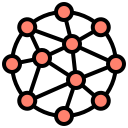
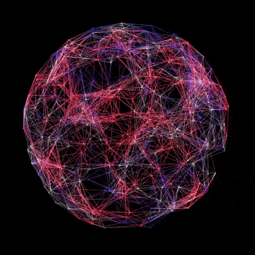
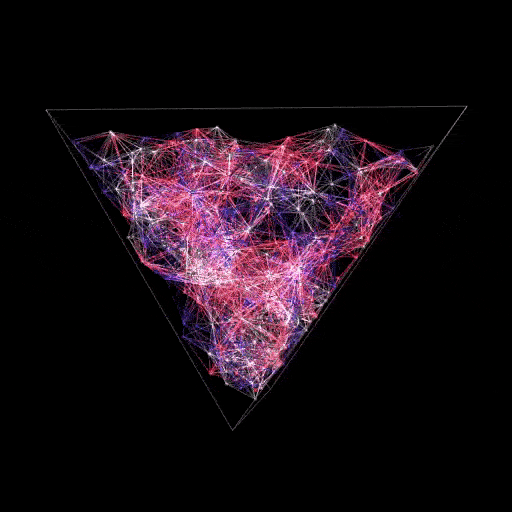

  

<h1 align="center">Geometric shapes with particles</h1>

  
  
  
  

The set of several geometric shapes with particles moving inside.

<a href="https://a-rudenko.github.io/geometric-particles">Live demo</a>

Main logic:
<ul>
  <li>creates a scene and a camera</li>
  <li>creates particles with settings for a certain geometric shape</li>
  <li>creates a WebGL renderer for the scene and camera</li>
  <li>adds that viewport to the element (#container)</li>
  <li>animates the particles within the scene for the camera</li>
</ul>

There are some settings:
<ul>
  <li>
    Particles settings:
    <ul>
      <li>show/hide points</li>
      <li>show/hide meshes</li>
      <li>limit connections</li>
      <li>maximum connection count</li>
      <li>minimum connection distance</li>
      <li>particle count</li>
      <li>particle speed</li>
    </ul>
  </li>
  <li>
    Motion settings:
    <ul>
      <li>auto rotation</li>
      <li>rotation speed</li>
      <li>touch/mouse rotation</li>
    </ul>
  </li>
  <li>Color settings</li>
</ul>

<h2>Credits</h2>
It is mainly developed using the JavaScript 3D library <a href="https://github.com/mrdoob/three.js">three.js</a>.

<h2>License</h2>
<a href="https://github.com/a-rudenko/geometric-particles/blob/main/LICENSE">MIT</a>